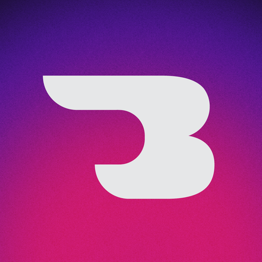
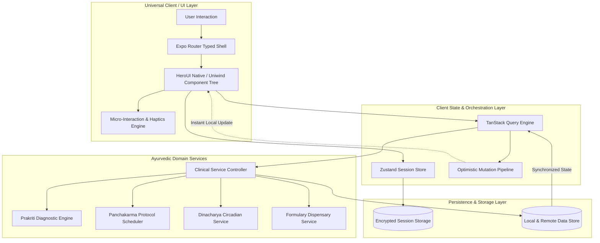
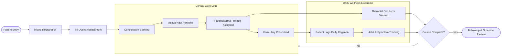

<div align="center">

  

# AyurSutra

### Universal Clinical EMR, Panchakarma Care Suite & Ayurvedic Patient Portal

  <p align="center">
    A production-grade, cross-platform healthcare operating system built with <strong>Expo SDK 57</strong>, <strong>React Native</strong>, and <strong>React 19</strong>. Unified care delivery across <strong>iOS</strong>, <strong>Android</strong>, and installable <strong>Web PWA</strong> from a single codebase.
  </p>

  <p align="center">
    <a href="#-animated-showcase"><strong>Explore Showcase »</strong></a>
    <br />
    <br />
    <a href="#-getting-started">Getting Started</a>
    ·
    <a href="#-architecture-flow">Architecture</a>
    ·
    <a href="#-uiux--motion-system">Design System</a>
    ·
    <a href="#-features">Features</a>
    ·
    <a href="#-roadmap">Roadmap</a>
  </p>

  <p align="center">
    <!-- Build & Runtime Badges -->
    <a href="https://expo.dev"></a>
    <a href="https://reactnative.dev"></a>
    <a href="https://react.dev"></a>
    <a href="https://www.typescriptlang.org"></a>
    <a href="https://tailwindcss.com"></a>
    <a href="https://tanstack.com/query"></a>
    
    
  </p>

  <p align="center">
    <a href="https://ayursutra-app.pages.dev">
      
    </a>
    <a href="#-getting-started">
      
    </a>
    <a href="https://github.com/Naval721/AyurSutra-CP/issues/new?template=bug_report.md">
      
    </a>
    <a href="https://github.com/Naval721/AyurSutra-CP/issues/new?template=feature_request.md">
      
    </a>
  </p>

</div>

---

## ⚡ The Pitch

Traditional Ayurvedic healthcare delivery is bottlenecked by fragmented workflows: multi-day Panchakarma protocols tracked in paper binders, classical Prakriti questionnaires calculated manually, and patient lifestyle regimens (_Dinacharya_) disconnected from clinical oversight.

**AyurSutra bridges traditional Vedic medicine and modern healthcare engineering.** It delivers an integrated, real-time clinical platform connecting treating Vaidyas, Panchakarma therapists, and patients through a unified health record.

- **Classical Ayurvedic Domain Engine** — Algorithmic Tri-Dosha assessment (_Vata, Pitta, Kapha_ and classical Tridoshic balancing), phased Panchakarma stage protocols (_Purva, Pradhana, Paschat Karma_), and classical formulation dispensary.
- **Role-Engineered Workspaces** — Three purpose-built interfaces (Doctor Consultation Suite, Therapist Treatment Checklist, and Patient Daily Portal) operating from a single role-based authorization shell.
- **Universal Native & Web Runtime** — True cross-platform parity on iOS, Android, and desktop/tablet PWA powered by Expo Router typed routing and offline service workers.
- **Pro-Grade Craftsmanship** — Bespoke medical UI built with HeroUI Native, Tailwind CSS v4 design tokens, tactile haptics, and zero-latency optimistic state updates.

---

## 🎬 Animated Showcase

<!-- Placeholders for visual documentation assets -->

<div align="center">
  <table>
    <tr>
      <td width="50%" align="center">
        <h4>Patient Portal & Daily Dinacharya</h4>
        
        <p><sub><code>docs/assets/showcase-patient-portal.gif</code> — Circadian habit tracking, optimistic state commits & tactile haptics</sub></p>
      </td>
      <td width="50%" align="center">
        <h4>Doctor Roster & Consultation Suite</h4>
        
        <p><sub><code>docs/assets/showcase-doctor-roster.gif</code> — Multi-patient roster, live check-ins, consultation notes & Nadi pulse pariksha</sub></p>
      </td>
    </tr>
    <tr>
      <td width="50%" align="center">
        <h4>Prakriti Constitution Assessment</h4>
        
        <p><sub><code>docs/assets/showcase-prakriti-scoring.gif</code> — Algorithmic diagnostic scoring, Tri-Dosha bar chart & clinical guidance</sub></p>
      </td>
      <td width="50%" align="center">
        <h4>Panchakarma Protocol & Sessions</h4>
        
        <p><sub><code>docs/assets/showcase-panchakarma-sessions.gif</code> — Phased therapy tracking (Purva, Pradhana, Paschat) & therapist execution</sub></p>
      </td>
    </tr>
  </table>
</div>

<details>
  <summary><strong>Explore Additional Interaction Showcases (Micro-Interactions & Theming)</strong></summary>

  <br />

| Asset Filename                                 | Interaction Depicted                                                | Focus Area             |
| :--------------------------------------------- | :------------------------------------------------------------------ | :--------------------- |
| `docs/assets/interaction-role-switch.gif`      | Fast 1-tap authenticated portal switching                           | Auth & Access Engine   |
| `docs/assets/interaction-formulary-search.gif` | Instant formulary search, dosage configuration & anupana assignment | Prescription Builder   |
| `docs/assets/interaction-symptom-log.gif`      | Agni digestion scale, sleep quality and symptom selection           | Patient Health Journal |
| `docs/assets/interaction-theme-transition.gif` | Saffron and Sandalwood light/dark semantic token transitions        | Design System          |

</details>

---

## 🌟 Core Features

### 🌿 Ayurvedic Clinical Domain

- **Tri-Dosha Prakriti Engine** — Algorithmic scoring evaluating physical traits, digestive capacity (_Agni_), and mental patterns, supporting classical dual-dosha and _Sama / Tridoshic_ constitutions.
- **Phased Panchakarma Protocol Manager** — Schedules and tracks specialized therapies (e.g. _Virechana, Vamana, Basti, Shirodhara_) across _Purva Karma_ (preparatory), _Pradhana Karma_ (primary detox), and _Paschat Karma_ (rejuvenation) stages.
- **Classical Formulary Dispensary** — Searchable formulation library with standard Ayurvedic dosages, administration frequencies, durations, and specific vehicles (_Anupana_ like warm water, honey, or ghee).
- **Nadi Pariksha Pulse Records** — Pulse rate, dominant dosha pulse, and qualitative diagnostic notation recorded directly during clinical consultations.

### 👥 Dedicated Multi-Role Workspaces

- **Doctor / Vaidya Workspace** — Daily appointment roster, time-filtered schedules, patient health directories, longitudinal clinical notes, and digital prescription issuance.
- **Therapist Workspace** — Focused daily therapy task checklist, real-time session status transitions (_Pending → In Progress → Completed / Skipped_), and protocol guidance.
- **Patient Portal** — Daily _Dinacharya_ circadian habits tracker, symptom journal (_Agni, Nidra, Ojas, Manas_), consultation booking with calendar strip, and active prescription viewer.

### 🎨 Human-Centered Design & Motion

- **Tactile Micro-Interactions** — Integrated haptic feedback (`expo-haptics`) across selection scales, checkboxes, habit commits, and booking actions.
- **Optimistic Local Mutators** — Immediate local cache reconciliation (`TanStack Query`) eliminates network waiting on repetitive tasks like habit check-offs.
- **Unified Theme Tokens** — Warm clinical aesthetic reflecting Ayurvedic heritage (Saffron, Sandalwood, Deep Bark) with full dark mode support via semantic CSS variables and Uniwind.

### 📱 Universal Platform Parity

- **Single Shared Codebase** — Zero duplicated logic between native iOS, Android, and web.
- **Progressive Web App (PWA)** — Offline service worker generation (`workbox-cli`) enabling full standalone installation on desktop and mobile browsers.
- **Accessibility Native (a11y)** — Minimum 44pt touch targets, WCAG 2.1 AA compliant color contrast, and descriptive accessibility attributes throughout.

---

## 🛠 Tech Stack

<table>
  <thead>
    <tr>
      <th>Layer</th>
      <th>Technologies</th>
      <th>Key Advantages</th>
    </tr>
  </thead>
  <tbody>
    <tr>
      <td><strong>Core Runtime</strong></td>
      <td>
        
        
        
      </td>
      <td>React Compiler optimization, native 60fps bridge, universal platform APIs</td>
    </tr>
    <tr>
      <td><strong>Routing & Navigation</strong></td>
      <td>
        
      </td>
      <td>File-based universal routing, deeply typed routes, safe area integration</td>
    </tr>
    <tr>
      <td><strong>Styling & Design System</strong></td>
      <td>
        
        
        
      </td>
      <td>Compile-time CSS extraction, semantic light/dark tokens, cross-platform styling</td>
    </tr>
    <tr>
      <td><strong>State & Cache</strong></td>
      <td>
        
        
        
      </td>
      <td>Optimistic cache mutations, automated revalidation, persistent session memory</td>
    </tr>
    <tr>
      <td><strong>Validation & Dates</strong></td>
      <td>
        
        
      </td>
      <td>Runtime schema validation, strict timestamp and operational window calculations</td>
    </tr>
    <tr>
      <td><strong>Tooling & Linting</strong></td>
      <td>
        
        
        
      </td>
      <td>Sub-second type-aware rust-based linting, automated PWA service worker caching</td>
    </tr>
  </tbody>
</table>

---

## 🏛 Architecture Flow

The system employs a strict unidirectional, decoupled client-service architecture designed for universal native and web runtimes:



---

## 🔄 User Journey & Clinical Flow



---

## 🎨 UI/UX & Design Philosophy

AyurSutra adheres to an authentic, human-crafted design language engineered to balance luxury Ayurvedic warmth with clinical medical authority:

### 1. Color Palette & Semantic Tokens

- **Herb & Earth Tones**: Natural bark charcoals (`#4a3b2c`), warm herbal cream (`#faf3e7`), and ceremonial saffron terracotta (`#dd8c2d`).
- **Classical Tri-Dosha Triad**:
  - **Vata** (_Air + Ether_): Ethereal lavender indigo (`#6f7fd0`)
  - **Pitta** (_Fire + Water_): Radiant herbal ochre (`#d4703a`)
  - **Kapha** (_Earth + Water_): Restorative jade teal (`#3f9c92`)
- **Tokens**: Defined in `global.css` using `oklch` color spaces, synchronized to `lib/theme.ts` for native canvas and status bar parity.

### 2. Motion System & Ergonomics

- **Easing & Curves**: Fast standard cubic ease-out curves (`cubic-bezier(0.16, 1, 0.3, 1)`).
- **Durations**: Action feedback runs within **120ms–200ms** to preserve a snappy, responsive feel.
- **Tactile Haptic Hierarchy**:
  - `Selection`: Light tap on ratings, tabs, and radio pills.
  - `Toggle`: Medium impact on Dinacharya checkboxes.
  - `Success`: Confirmatory double-pulse on booking and note creation.
  - `Error`: Rigid alert vibration on missing required fields.
- **Accessibility**: Respects OS `prefers-reduced-motion` settings automatically across web and native animations.

---

## 📷 Screenshots & Layout Gallery

|         Viewport         |                             Primary Screen                              |                          Feature Focus                           |
| :----------------------: | :---------------------------------------------------------------------: | :--------------------------------------------------------------: |
|     **Mobile (iOS)**     |           |     Dinacharya rituals, Prakriti bar, consultation countdown     |
|   **Mobile (Android)**   |           |      Daily timeline, status chips, patient chief complaint       |
| **Tablet / Desktop Web** |  |      Patient search, medical records, Panchakarma progress       |
|    **PWA Standalone**    |  | Medicine formulary, anupana dosage, pathya/apathya dietary notes |
|     **Empty State**      |          |   Thoughtful clinical illustrations and non-blocking guidance    |
|    **Modal / Intake**    |              |    Structured health concern intake with privacy verification    |

---

## 📂 Project Structure

```
ayursutra/
├── app/                           # Universal Expo Router file-based route tree
│   ├── (auth)/                    # Patient & Practitioner authentication portals
│   ├── (patient)/                 # Patient tab views, journal logs, Prakriti wizard
│   ├── (practitioner)/            # Doctor & Therapist consultation, patients, prescriptions
│   └── _layout.tsx                # App root provider wrapper (Theme, QueryClient, Sessions)
├── components/
│   ├── practitioner/              # Note composers, pulse records, clinical tools
│   └── ui/                        # Design system primitives (Screen, Surface, Cards, Chips)
├── hooks/                         # Universal custom hooks (Haptics, UI sensors)
├── lib/
│   ├── api/                       # Service abstraction controllers (Decoupled data access)
│   ├── mock/                      # Local demonstration datasets & DB simulators
│   ├── store/                     # Zustand persistent session state
│   ├── format.ts                  # Localization, 12h time ranges, classical Ayurvedic formats
│   ├── haptics.ts                 # Cross-platform tactile haptic orchestrator
│   ├── prakriti.ts                # Algorithmic Tri-Dosha diagnostic scoring engine
│   ├── theme.ts                   # Hex mirrors of CSS design tokens for native primitives
│   └── types.ts                   # Domain TypeScript models & clinical interfaces
├── public/                        # PWA manifests, icons and web static assets
├── scripts/                       # Build validation utilities & token verification
├── global.css                     # Tailwind CSS v4 & Uniwind theme token declarations
├── app.config.ts                  # Expo runtime configuration & dynamic build plugins
├── metro.config.cjs               # Metro bundler config with Uniwind CSS transformer
└── package.json                   # Project manifests, scripts and dependency declarations
```

---

## 🚀 Getting Started

### Prerequisites

- **Node.js**: `v20.19.4` or newer (LTS recommended)
- **npm**: `v10.9.0` or newer
- **Expo Go** app on mobile device (or iOS Simulator / Android Emulator)

### 1. Installation

Clone the repository and install all dependencies:

```bash
git clone https://github.com/Naval721/AyurSutra-CP.git
cd AyurSutra-CP
npm install
```

### 2. Run Locally in Development

Start the universal Metro development server:

```bash
npx expo start
```

- Press <kbd>w</kbd> in your terminal to open the web application in your default browser.
- Scan the terminal QR code using **Expo Go** on iOS or Android.
- Press <kbd>i</kbd> for iOS Simulator or <kbd>a</kbd> for Android Emulator.

### 3. Build & Production Export

```bash
# Export static web bundle to dist/
npm run export:web

# Build production Progressive Web App (PWA) with Workbox service worker
npm run build:pwa

# Verify and execute native local builds
npm run ios
npm run android
```

### 4. Code Quality & Verification

AyurSutra utilizes high-performance Rust-based `oxc` tooling for sub-second verification:

```bash
# Run type-aware linting across all files
npm run lint

# Verify theme token synchronization
npm run lint:css

# Run full TypeScript compiler check
npx tsc --noEmit

# Format codebase
npm run format
```

---

## 💻 Configuration & Environment

Environment variables are managed dynamically via `app.config.ts`. Sensitive credentials and endpoints are resolved at build time:

```bash
# Optional build parameters
AYURSUTRA_APP_VERSION="1.0.0"
AYURSUTRA_IOS_BUNDLE_ID="YOUR_IOS_BUNDLE_ID"
AYURSUTRA_ANDROID_PACKAGE="YOUR_ANDROID_PACKAGE"
AYURSUTRA_APP_STORE_APP_ID="YOUR_APP_STORE_ID"
```

---

## 🗺 Roadmap

- [x] Universal cross-platform core (iOS, Android, PWA)
- [x] Algorithmic Tri-Dosha Prakriti assessment engine
- [x] Multi-stage Panchakarma protocol management (_Purva, Pradhana, Paschat Karma_)
- [x] Real-time Dinacharya habit tracker with optimistic local state
- [x] Clinical prescription builder with classical Ayurvedic vehicle (_Anupana_) support
- [x] Dark / Light theme synchronization with Uniwind and Tailwind CSS v4
- [ ] Tele-consultation video module with WebRTC
- [ ] Multi-lingual interface support (Hindi, Sanskrit, Malayalam, Tamil)
- [ ] Offline-first sync engine with local encrypted SQLite database
- [ ] FHIR / ABDM (Ayushman Bharat Digital Mission) compliance adapter

---

## 🤝 Contributing

Contributions to AyurSutra are welcomed! Please follow these steps:

1. **Fork** the repository.
2. **Create a feature branch**:
   ```bash
   git checkout -b feature/amazing-ayurvedic-feature
   ```
3. **Commit your changes**:
   ```bash
   git commit -m "feat: implement herbal inventory tracker"
   ```
4. **Verify quality gates**:
   ```bash
   npm run lint && npm run lint:css && npx tsc --noEmit
   ```
5. **Push to your branch**:
   ```bash
   git push origin feature/amazing-ayurvedic-feature
   ```
6. **Open a Pull Request**.

---

## 📄 License

Distributed under the **MIT License**. See `LICENSE` for details.

---

## 🙏 Acknowledgements

- [Expo](https://expo.dev/) — Universal application framework
- [HeroUI Native](https://heroui.com/) — Accessible React Native UI primitives
- [Uniwind](https://github.com/uniwind) — Tailwind CSS v4 runtime for React Native
- [TanStack Query](https://tanstack.com/query) — Asynchronous state orchestration
- [Lucide Icons](https://lucide.dev/) — Modern iconography

---

<div align="center">
  <sub>Built with care for holistic healthcare practitioners worldwide.</sub>
  <br /><br />
  <a href="https://github.com/Naval721/AyurSutra-CP">
    ⭐ <strong>Star AyurSutra on GitHub if you find this project inspiring!</strong> ⭐
  </a>
</div>
